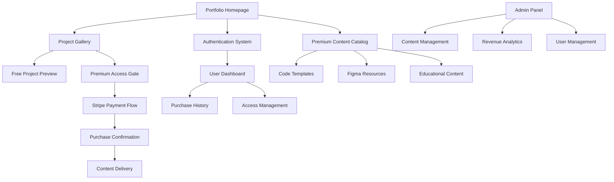
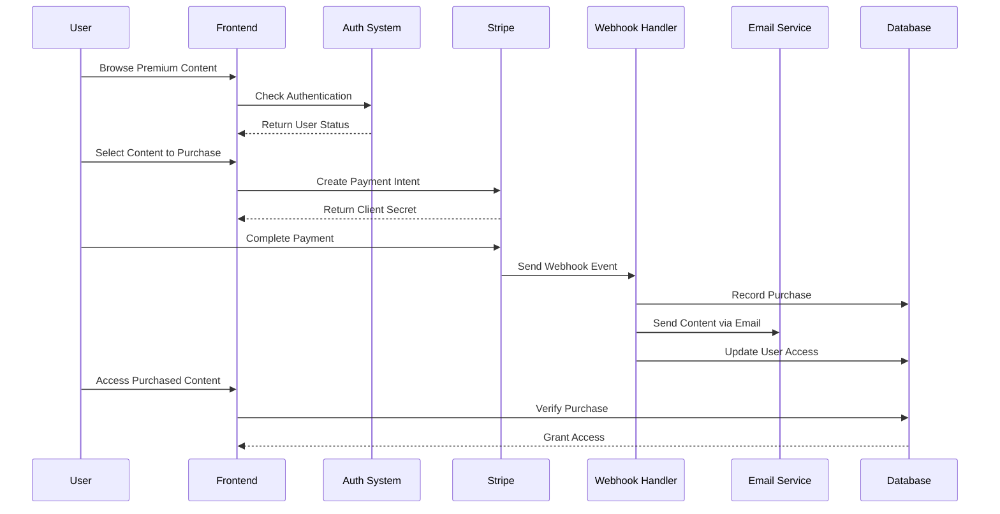
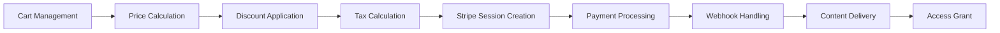
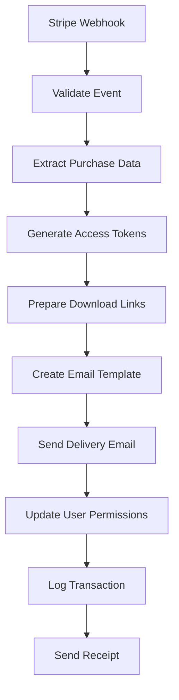
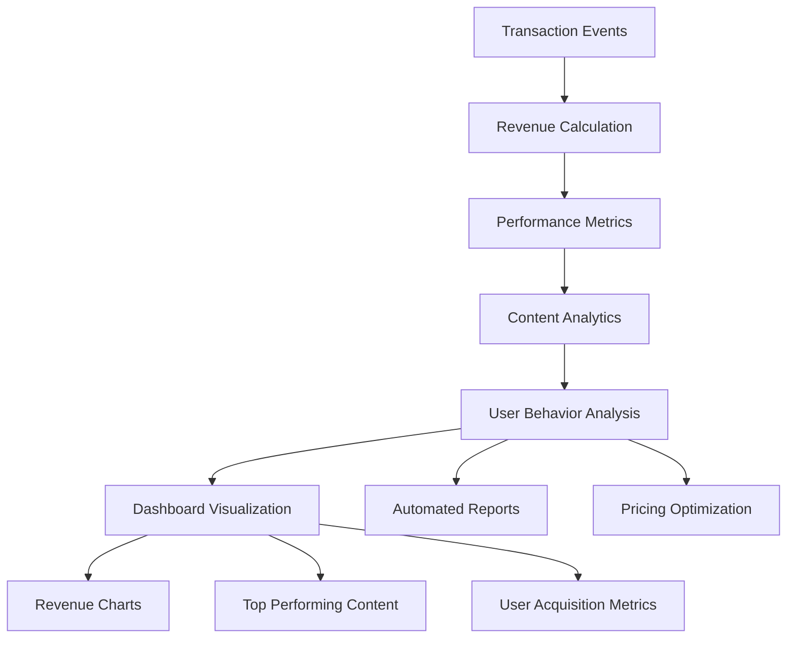
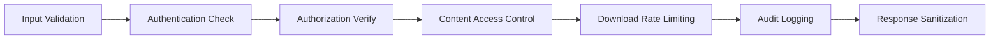

# Portfolio SaaS Transformation Design

## Overview

This design document outlines the transformation of José Vitor's portfolio from a static showcase into a comprehensive SaaS platform that monetizes development assets through a pay-per-access model. The system will enable users to purchase access to source code, Figma designs, and premium content through Stripe integration with automated delivery via webhooks.

## Architecture

### Frontend Application Structure



### Data Flow Architecture



## Component Architecture

### Premium Content Management

#### Project Enhancement Structure
```typescript
interface PremiumProject extends Project {
  premium: {
    enabled: boolean;
    price: number;
    currency: string;
    stripeProductId: string;
    stripePriceId: string;
    deliverables: {
      sourceCode?: {
        repository: string;
        branch: string;
        zipUrl?: string;
      };
      figmaFile?: {
        fileId: string;
        accessType: 'view' | 'duplicate';
      };
      documentation?: {
        fileUrl: string;
        format: 'pdf' | 'markdown';
      };
      assets?: {
        type: 'images' | 'icons' | 'fonts';
        downloadUrl: string;
      }[];
    };
    previewLimitations: {
      codeLines: number;
      figmaFrames: string[];
      documentationPages: number;
    };
  };
}
```

#### Content Catalog Component
```typescript
interface ContentCatalogProps {
  categories: ContentCategory[];
  filters: FilterOptions;
  searchQuery: string;
  sortBy: 'price' | 'popularity' | 'date';
}

interface ContentCategory {
  id: string;
  name: { pt: string; en: string };
  description: { pt: string; en: string };
  icon: string;
  items: PremiumContent[];
}

interface PremiumContent {
  id: string;
  type: 'project' | 'template' | 'design-system' | 'course';
  title: { pt: string; en: string };
  description: { pt: string; en: string };
  price: number;
  currency: string;
  previewAssets: PreviewAsset[];
  technologies: string[];
  difficulty: 'beginner' | 'intermediate' | 'advanced';
  estimatedDelivery: string;
}
```

### Payment Integration Layer

#### Stripe Integration Component
```typescript
interface StripePaymentProps {
  content: PremiumContent;
  user: User;
  onSuccess: (purchaseId: string) => void;
  onError: (error: string) => void;
}

interface PaymentSession {
  contentId: string;
  userId: string;
  amount: number;
  currency: string;
  stripeSessionId: string;
  status: 'pending' | 'completed' | 'failed' | 'cancelled';
  createdAt: Date;
  completedAt?: Date;
}
```

#### Purchase Management System


### User Experience Flow

#### Content Discovery Journey
1. **Browse Phase**: Users explore project gallery with clear premium indicators
2. **Preview Phase**: Limited preview of code snippets, Figma frames, and documentation
3. **Decision Phase**: Detailed content description, pricing, and testimonials
4. **Purchase Phase**: Streamlined Stripe checkout with guest and authenticated options
5. **Delivery Phase**: Immediate access grant and email delivery
6. **Access Phase**: Permanent access through user dashboard

#### Premium Content Presentation
```typescript
interface PremiumContentCard {
  preview: {
    codeSnippet: string;
    figmaPreview: string;
    demoGif: string;
    technologies: TechStack[];
  };
  pricing: {
    originalPrice: number;
    currentPrice: number;
    discount?: number;
    bundleOptions?: Bundle[];
  };
  social: {
    purchaseCount: number;
    rating: number;
    reviews: Review[];
  };
  delivery: {
    instant: boolean;
    estimatedTime: string;
    deliveryMethods: string[];
  };
}
```

## API Integration

### Stripe Payment Processing

#### Payment Intent Creation
```typescript
interface CreatePaymentIntent {
  contentIds: string[];
  userId?: string;
  customerEmail: string;
  metadata: {
    projectIds: string[];
    userLanguage: string;
    deliveryMethod: string;
  };
}

interface StripeWebhookHandler {
  eventTypes: [
    'payment_intent.succeeded',
    'payment_intent.payment_failed',
    'checkout.session.completed'
  ];
  actions: {
    onSuccess: (event: StripeEvent) => Promise<void>;
    onFailure: (event: StripeEvent) => Promise<void>;
    onRefund: (event: StripeEvent) => Promise<void>;
  };
}
```

#### Content Delivery Automation


### Backend Services Architecture

#### Webhook Processing Service
```typescript
interface WebhookProcessor {
  validateSignature(payload: string, signature: string): boolean;
  processPaymentSuccess(session: StripeSession): Promise<void>;
  generateDownloadLinks(contentIds: string[]): Promise<DownloadLink[]>;
  sendDeliveryEmail(user: User, content: DeliveredContent[]): Promise<void>;
  updateUserAccess(userId: string, contentIds: string[]): Promise<void>;
}

interface DownloadLink {
  contentId: string;
  type: 'zip' | 'figma' | 'pdf';
  url: string;
  expiresAt: Date;
  downloadLimit: number;
}
```

#### Access Control System
```typescript
interface AccessControlMiddleware {
  verifyUserAccess(userId: string, contentId: string): Promise<boolean>;
  generateTemporaryAccess(contentId: string, duration: number): Promise<string>;
  revokeAccess(userId: string, contentId: string): Promise<void>;
  trackAccessUsage(userId: string, contentId: string): Promise<void>;
}
```

## Data Models & ORM Mapping

### User Management Schema
```typescript
interface User {
  id: string;
  email: string;
  name: string;
  stripeCustomerId?: string;
  preferredLanguage: 'pt' | 'en';
  createdAt: Date;
  lastLogin?: Date;
  subscriptionStatus?: 'active' | 'cancelled' | 'trial';
}

interface UserPurchase {
  id: string;
  userId: string;
  contentId: string;
  stripePaymentIntentId: string;
  amount: number;
  currency: string;
  status: 'completed' | 'refunded';
  purchasedAt: Date;
  accessExpiresAt?: Date;
}

interface UserAccess {
  userId: string;
  contentId: string;
  accessType: 'purchased' | 'trial' | 'subscription';
  grantedAt: Date;
  lastAccessedAt?: Date;
  downloadCount: number;
  maxDownloads: number;
}
```

### Content Management Schema
```typescript
interface ContentAsset {
  id: string;
  contentId: string;
  type: 'source-code' | 'figma-file' | 'documentation' | 'assets';
  fileName: string;
  fileSize: number;
  storageUrl: string;
  checksumHash: string;
  metadata: {
    figmaFileId?: string;
    repositoryUrl?: string;
    format?: string;
    version?: string;
  };
}

interface ContentMetrics {
  contentId: string;
  views: number;
  previews: number;
  purchases: number;
  revenue: number;
  avgRating: number;
  reviewCount: number;
  lastUpdated: Date;
}
```

## Business Logic Layer

### Pricing Strategy Engine
```typescript
interface PricingStrategy {
  basePrice: number;
  discountRules: DiscountRule[];
  bundleOffers: BundleOffer[];
  regionalPricing: RegionalPrice[];
  dynamicPricing: boolean;
}

interface DiscountRule {
  type: 'bulk' | 'first-time' | 'seasonal' | 'loyalty';
  conditions: {
    minimumItems?: number;
    userTier?: string;
    dateRange?: { start: Date; end: Date };
  };
  discount: {
    type: 'percentage' | 'fixed';
    value: number;
  };
}

interface BundleOffer {
  id: string;
  name: { pt: string; en: string };
  contentIds: string[];
  bundlePrice: number;
  savings: number;
  validUntil?: Date;
}
```

### Revenue Analytics System


### Content Delivery Management
```typescript
interface DeliveryManager {
  prepareDelivery(purchase: UserPurchase): Promise<DeliveryPackage>;
  generateDownloadTokens(contentIds: string[], userId: string): Promise<DownloadToken[]>;
  trackDeliveryStatus(deliveryId: string): Promise<DeliveryStatus>;
  handleDeliveryFailure(deliveryId: string, error: Error): Promise<void>;
}

interface DeliveryPackage {
  id: string;
  userId: string;
  contentItems: ContentDeliverable[];
  downloadLinks: SecureDownloadLink[];
  emailTemplate: EmailTemplate;
  expirationDate: Date;
}

interface ContentDeliverable {
  contentId: string;
  type: 'zip' | 'figma-access' | 'repository-access' | 'pdf';
  accessUrl: string;
  instructions: { pt: string; en: string };
  supportContact: string;
}
```

## Middleware & Authentication

### Authentication Flow Enhancement
```typescript
interface AuthenticationMiddleware {
  requireAuth(optional?: boolean): ExpressMiddleware;
  requirePurchase(contentId: string): ExpressMiddleware;
  requireAdmin(): ExpressMiddleware;
  rateLimitDownloads(contentId: string): ExpressMiddleware;
}

interface JWTPayload {
  userId: string;
  email: string;
  role: 'user' | 'admin';
  purchasedContent: string[];
  subscriptionTier?: string;
  iat: number;
  exp: number;
}
```

### Security Considerations


## Testing Strategy

### Unit Testing Coverage
```typescript
interface TestingSuite {
  payment: {
    stripeIntegration: StripeIntegrationTests;
    webhookProcessing: WebhookProcessingTests;
    priceCalculation: PriceCalculationTests;
  };
  content: {
    accessControl: AccessControlTests;
    deliveryManagement: DeliveryManagementTests;
    fileGeneration: FileGenerationTests;
  };
  user: {
    authentication: AuthenticationTests;
    purchaseHistory: PurchaseHistoryTests;
    permissionManagement: PermissionManagementTests;
  };
}
```

### Integration Testing Scenarios
1. **End-to-End Purchase Flow**: Complete user journey from content discovery to delivery
2. **Webhook Reliability**: Stripe webhook processing under various conditions
3. **Content Delivery**: File generation and email delivery systems
4. **Access Control**: Permission verification and enforcement
5. **Error Handling**: Payment failures, delivery failures, and system recovery
6. **Performance Testing**: Load testing for high-volume purchases and downloads

## Implementation Roadmap

### Phase 1: Foundation (Weeks 1-3)
- Enhanced authentication system with user dashboard
- Basic premium content marking in existing projects
- Stripe integration setup and webhook infrastructure
- Email delivery system implementation

### Phase 2: Core Features (Weeks 4-6)  
- Premium content catalog and pricing engine
- Payment processing and purchase management
- Content delivery automation
- User access control and download management

### Phase 3: Advanced Features (Weeks 7-8)
- Bundle offers and discount system
- Revenue analytics and admin dashboard
- Advanced content preview system
- Mobile-responsive payment flows

### Phase 4: Optimization (Weeks 9-10)
- Performance optimization and caching
- SEO optimization for content pages
- A/B testing for pricing strategies
- Advanced analytics and reporting

## Revenue Projections

### Pricing Model
```typescript
interface PricingTiers {
  individual: {
    sourceCode: { min: 15, max: 50 }; // USD
    figmaDesign: { min: 10, max: 30 };
    fullProject: { min: 25, max: 80 };
    documentation: { min: 5, max: 15 };
  };
  bundles: {
    projectComplete: { discount: 0.20 }; // 20% off individual prices
    designSystem: { discount: 0.25 };
    learningPath: { discount: 0.30 };
  };
  subscription: {
    monthly: 29; // Unlimited access to new content
    annual: 290; // 2 months free
  };
}
```

### Market Validation Metrics
- **Target Audience**: Developers learning React/TypeScript, design students, agencies
- **Content Value**: High-quality, production-ready code with educational documentation
- **Competitive Advantage**: Bilingual content, real-world project examples, ongoing support
- **Success Metrics**: >100 purchases in first month, >$2000 MRR within 6 months