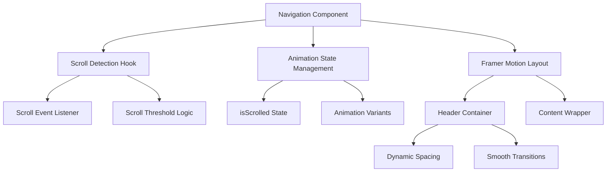

# Music Notification System with Scroll-Responsive Navigation Header

## Overview

Implement a comprehensive audio experience system that includes:
1. **Scroll-responsive navigation header animation** - Header shrinks when scrolling
2. **Music notification system** - Reusing existing comp-296.tsx component with enhanced props to display "Now Playing" information

## Music Notification Feature

### Enhanced comp-296.tsx Component

Modify the existing comp-296.tsx to accept music-related props while maintaining its original notification structure:

```typescript
// Enhanced comp-296.tsx (Modified, not replaced)
import { RadioIcon, XIcon, Music } from "lucide-react"
import { motion } from "framer-motion"
import { Button } from './button';

interface Comp296Props {
  onClose: () => void;
  // New optional props for music functionality
  isMusicNotification?: boolean;
  songTitle?: string;
  artist?: string;
  isPlaying?: boolean;
}

export default function Component({ 
  onClose, 
  isMusicNotification = false,
  songTitle = "New Feature is coming!",
  artist = "Now, and you chat with my personal assistant.",
  isPlaying = false
}: Comp296Props) {
  
  // Dynamic content based on notification type
  const notificationContent = {
    icon: isMusicNotification ? Music : RadioIcon,
    title: isMusicNotification ? songTitle : "New Feature is coming!",
    description: isMusicNotification ? artist : "Now, and you chat with my personal assistant.",
    iconAnimation: isMusicNotification && isPlaying
  };

  return (
    <div className="fixed top-20 left-1/2 transform -translate-x-1/2 z-50">
      <motion.div 
        initial={{ opacity: 0, y: -50, scale: 0.9 }}
        animate={{ opacity: 1, y: 0, scale: 1 }}
        exit={{ opacity: 0, y: -50, scale: 0.9 }}
        transition={{ duration: 0.4, ease: "easeOut" }}
        className="relative flex w-full max-w-xs flex-col gap-2 rounded-lg border bg-background/95 backdrop-blur-md p-4 shadow-xl sm:max-w-md md:max-w-lg"
      >
        <div className="flex items-center gap-4">
          
          <motion.div
            className="flex h-9 w-9 shrink-0 items-center justify-center rounded-full border bg-accent-primary/20"
            animate={notificationContent.iconAnimation ? {
              scale: [1, 1.1, 1],
              rotate: [0, 5, -5, 0]
            } : {}}
            transition={notificationContent.iconAnimation ? {
              duration: 0.6,
              repeat: Infinity,
              repeatType: "reverse"
            } : {}}
            aria-hidden="true"
          >
            <notificationContent.icon className={`h-5 w-5 ${
              isMusicNotification ? 'text-accent-primary' : ''
            }`} />
          </motion.div>

          <div className="grid gap-1">
            <p className="text-sm font-medium text-white">{notificationContent.title}</p>
            <p className="text-sm text-muted-foreground">{notificationContent.description}</p>
          </div>
          
          <Button
            variant="ghost"
            className="group -my-1.5 -me-2 size-8 shrink-0 p-0 hover:bg-transparent"
            aria-label="Close notification"
            onClick={onClose}
          >
            <XIcon
              size={16}
              className="opacity-60 transition-opacity group-hover:opacity-100"
              aria-hidden="true"
            />
          </Button>
        </div>
      </motion.div>
    </div>
  )
}
```

### Integration with Banner Component

```typescript
// Enhanced Banner.tsx using existing comp-296.tsx
import { motion } from 'framer-motion';
import { Github, Linkedin, Mail, Download, ChevronDown, Volume2, VolumeX } from 'lucide-react';
import { useState } from 'react';
import Comp412 from './ui/comp-412';
import Comp296 from './ui/comp-296'; // Using existing component

interface BannerProps {
  isPlaying: boolean;
  setIsPlaying: (playing: boolean) => void;
}

const Banner = ({ isPlaying, setIsPlaying }: BannerProps) => {
  const [showMusicNotification, setShowMusicNotification] = useState(false);
  
  // Music information extracted from audio file
  const currentTrack = {
    title: "Paranoid (Just Raw Instrumental)",
    artist: "Unknown Artist"
  };

  const handleAudioToggle = () => {
    setIsPlaying(!isPlaying);
    
    // Show music notification when starting to play
    if (!isPlaying) {
      setShowMusicNotification(true);
      // REMOVED: Auto-hide timer - notification stays visible until manually closed
    } else {
      // Hide notification when stopping audio
      setShowMusicNotification(false);
    }
  };

  const handleCloseNotification = () => {
    setShowMusicNotification(false);
  };

  // ... existing Banner code ...

  return (
    <>
      {/* Reusing existing comp-296 with music props */}
      {showMusicNotification && (
        <Comp296
          onClose={handleCloseNotification}
          isMusicNotification={true}
          songTitle={currentTrack.title}
          artist={currentTrack.artist}
          isPlaying={isPlaying}
        />
      )}
      
      <section id='home' className='min-h-screen flex items-center justify-center relative overflow-hidden'>
        {/* ... existing Banner content ... */}
        
        <motion.button
          onClick={handleAudioToggle} // Updated to use new handler
          className="ml-2 p-1 rounded-full text-gray-400 hover:text-accent-primary transition-colors duration-200 focus:outline-none focus:ring-2 focus:ring-gray-600 focus:ring-opacity-75"
          whileHover={{ scale: 1.1 }}
          whileTap={{ scale: 0.9 }}
          aria-label={isPlaying ? 'Pausar música' : 'Tocar música'}
        >
          {isPlaying ? <Volume2 size={24} /> : <VolumeX size={24} />}
        </motion.button>
        
        {/* ... rest of Banner content ... */}
      </section>
    </>
  )
}

export default Banner;
```

## Component Reuse Strategy

### Enhanced Props for comp-296.tsx

| Prop | Type | Default | Purpose |
|------|------|---------|----------|
| `onClose` | `() => void` | Required | Original close functionality |
| `isMusicNotification` | `boolean` | `false` | Switches between music and general notification mode |
| `songTitle` | `string` | `"New Feature is coming!"` | Music title or original notification title |
| `artist` | `string` | `"Now, and you chat..."` | Artist name or original notification description |
| `isPlaying` | `boolean` | `false` | Controls music icon animation |

### Smart Content Switching

```typescript
// Dynamic content based on notification type
const notificationContent = {
  icon: isMusicNotification ? Music : RadioIcon,
  title: isMusicNotification ? songTitle : "New Feature is coming!",
  description: isMusicNotification ? artist : "Now, and you chat with my personal assistant.",
  iconAnimation: isMusicNotification && isPlaying
};
```

### Component Behavior Matrix

| Usage Scenario | `isMusicNotification` | Content Display | Icon | Animation | Visibility |
|----------------|----------------------|------------------|------|-----------|------------|
| **Original Usage** | `false` | "New Feature is coming!" | RadioIcon | None | Manual close only |
| **Music Playing** | `true` + `isPlaying: true` | Song title + Artist | Music | Pulse + Rotate | Until manually closed |
| **Music Paused** | `true` + `isPlaying: false` | Song title + Artist | Music | Static | Until manually closed |

## Implementation Benefits

### 1. Code Reusability
- **Single Component**: No duplicate code or new components
- **Backward Compatible**: Original functionality preserved
- **Flexible Design**: Handles multiple notification types

### 2. Consistent UI/UX
- **Same Styling**: Maintains design consistency
- **Same Animations**: Reuses existing enter/exit transitions
- **Same Positioning**: Top-center notification pattern

### 3. Enhanced Functionality
- **Music Icon**: Switches to Music icon when `isMusicNotification={true}`
- **Dynamic Animation**: Icon pulses and rotates when music is playing
- **Smart Content**: Displays song info instead of generic message

### 4. Easy Integration
```typescript
// For music notifications
<Comp296
  onClose={handleClose}
  isMusicNotification={true}
  songTitle="Paranoid (Just Raw Instrumental)"
  artist="Unknown Artist"
  isPlaying={isPlaying}
/>

// For original notifications
<Comp296
  onClose={handleClose}
  // No additional props needed - uses defaults
/>
```

### Complete Enhanced Navigation.tsx

```typescript
// Imports
import { Menu, X, LogOut } from 'lucide-react';
import { motion, AnimatePresence } from 'framer-motion';
import { Link, useNavigate, useLocation } from 'react-router-dom';
import { useEffect, useState } from 'react';

// Import components
import { Avatar, AvatarFallback } from './ui/avatar';

const Navigation = () => {

    // States
    const [isOpen, setIsOpen] = useState(false);
    const [activeSection, setActiveSection] = useState('home');
    const [isScrolled, setIsScrolled] = useState(false);
    const navigate = useNavigate();
    const location = useLocation();

    const isHomePage = location.pathname === "/";

    // Navigation items
    const navItems = [
        { id: 'home', label: 'Início' },
        { id: 'about', label: 'Sobre' },
        { id: 'projects', label: 'Projetos' },
        { id: 'articles', label: 'Artigos' },
        { id: 'experience', label: 'Experiência' },
        { id: 'contact', label: 'Contato' },
    ];

    useEffect(() => {
        const handleScroll = () => {
            const scrollY = window.scrollY;
            const scrollThreshold = 80;
            
            // Update scroll state for header animation
            setIsScrolled(scrollY > scrollThreshold);
            
            // Handle section highlighting only on home page
            if (isHomePage) {
                const sections = navItems.map(item => document.getElementById(item.id));
                const scrollPosition = scrollY + 100;

                for (let i = sections.length - 1; i >= 0; i--) {
                    const section = sections[i];
                    if (section && section.offsetTop <= scrollPosition) {
                        setActiveSection(navItems[i].id);
                        break;
                    }
                }
            }
        };

        window.addEventListener('scroll', handleScroll);
        return () => window.removeEventListener('scroll', handleScroll);
    }, [isHomePage]);

    const scrollToSection = (sectionId: string) => {
        if (isHomePage) {
            const element = document.getElementById(sectionId);
            if (element) {
                element.scrollIntoView({ behavior: 'smooth' });
            }
        } else {
            navigate(`/#${sectionId}`);
        }
        setIsOpen(false);
    };

    // Here handle SignOut
    // ...

    // Animation variants for header scroll response
    const headerVariants = {
        normal: {
            top: "1.5rem", // top-6 (24px)
            left: "1.5rem", // inset-x-6 (24px)
            right: "1.5rem",
            borderRadius: "1rem", // rounded-2xl (16px)
            transition: { duration: 0.3, ease: "easeInOut" }
        },
        compact: {
            top: "0.5rem", // top-2 (8px)
            left: "0.5rem", // inset-x-2 (8px)
            right: "0.5rem",
            borderRadius: "0.75rem", // rounded-xl (12px)
            transition: { duration: 0.3, ease: "easeInOut" }
        }
    };

    return (
        <motion.nav
            initial={{ y: -100 }}
            animate={{
                y: 0,
                ...headerVariants[isScrolled ? 'compact' : 'normal']
            }}
            className="fixed z-50 bg-white/[0.05] backdrop-blur-3xl border border-white/[0.3] shadow-lg"
        >

            <div className="max-w-8xl mx-auto px-4 sm:px-6 lg:px-8">
                <motion.div 
                    className="flex justify-between items-center"
                    animate={{
                        height: isScrolled ? "3.5rem" : "4rem", // h-14 vs h-16
                        paddingTop: isScrolled ? "0.75rem" : "1rem",
                        paddingBottom: isScrolled ? "0.75rem" : "1rem"
                    }}
                    transition={{ duration: 0.3, ease: "easeInOut" }}
                >
                    <motion.div
                        className="text-xl font-bold gradient-text"
                        whileHover={{ scale: 1.05 }}
                    >
                        <Link to="/" className='text-light-100'> José vitor </Link>
                    </motion.div>

                    {/* Desktop Navigation */}
                    <div className="hidden md:flex items-center space-x-8">
                        <div className="flex items-center justify-between gap-6">
                            {isHomePage && navItems.map((item) => (
                                <motion.button
                                    key={item.id}
                                    onClick={() => scrollToSection(item.id)}
                                    className={`px-3 py-2 text-base cursor-pointer font-medium transition-colors duration-200 ${
                                        activeSection === item.id
                                            ? 'text-accent-primary'
                                            : 'text-gray-300 hover:text-white'
                                    }`}
                                    whileHover={{ scale: 1.05 }}
                                    whileTap={{ scale: 0.95 }}
                                >
                                    {item.label}
                                </motion.button>
                            ))}

                            {/* Button Sign In */}
                            <motion.button
                                className="px-4 py-2 text-sm font-medium cursor-pointer bg-gray-100 text-black rounded-full flex items-center gap-2"
                                whileHover={{ scale: 1.05 }}
                                whileTap={{ scale: 0.95 }}
                            >
                                <LogOut size={16} /> Entrar
                            </motion.button>

                            {/* Avatar user */}
                            <Avatar className="h-8 w-8 ml-8">
                                <AvatarFallback>JV</AvatarFallback>
                            </Avatar>
                        </div>
                    </div>

                    {/* Mobile Navigation Button */}
                    <div className='md:hidden'>
                        <motion.button
                            onClick={() => setIsOpen(!isOpen)}
                            className="text-white hover:text-accent-primary transition-colors"
                            whileTap={{ scale: 0.95 }}
                        >

                            {/* Show Menu Icon */}
                            {isOpen ? <X size={24} /> : <Menu size={24} />}

                        </motion.button>
                    </div>
                </motion.div>

                {/* Mobile Navigation Menu */}
                <AnimatePresence>
                    {isOpen && (
                        <motion.div
                            initial={{ opacity: 0, height: 0 }}
                            animate={{ opacity: 1, height: 'auto' }}
                            exit={{ opacity: 0, height: 0 }}
                            className="md:hidden"
                        >
                            <div className="px-6 pt-4 pb-6 mb-6 rounded-2xl space-y-1 bg-dark-100/95 backdrop-blur-md">
                                {isHomePage && navItems.map((item) => (
                                    <motion.button
                                        key={item.id}
                                        onClick={() => scrollToSection(item.id)}
                                        className={`block w-full text-left px-3 py-2 text-lg font-medium transition-colors duration-200 ${
                                            activeSection === item.id
                                                ? 'text-accent-primary'
                                                : 'text-gray-300 hover:text-white'
                                        }`}
                                        whileHover={{ x: 10 }}
                                    >
                                        {item.label}
                                    </motion.button>
                                ))}
                                <motion.button
                                    className="w-full text-left px-3 py-2 text-lg font-medium cursor-pointer bg-gray-100 text-black rounded-full flex items-center justify-center gap-2 mt-4"
                                    whileHover={{ scale: 1.02 }}
                                    whileTap={{ scale: 0.98 }}
                                >
                                    <LogOut size={20} /> Entrar
                                </motion.button>
                            </div>
                        </motion.div>
                    )}
                </AnimatePresence>
            </div>
        </motion.nav>
    )
}

export default Navigation
```

## Implementation Instructions

### Phase 1: Enhance comp-296.tsx with Music Props
1. **Add optional props** for music functionality to existing interface
2. **Import Music icon** from Lucide React alongside existing RadioIcon
3. **Implement content switching logic** based on `isMusicNotification` prop
4. **Add conditional animation** for music icon when playing
5. **Update positioning** to be fixed top-center for both use cases

### Phase 2: Update Banner Component Integration
1. **Add state management** for `showMusicNotification`
2. **Enhance audio toggle handler** to show/hide music notification
3. **Define current track information** (title and artist)
4. **REMOVED: Auto-hide timer** - notification stays visible until manually closed
5. **Add conditional rendering** of comp-296 with music props

### Phase 3: Testing & Validation
1. **Original Functionality Test**: Verify existing notification still works
2. **Music Notification Test**: Confirm music info displays correctly
3. **Icon Animation Test**: Validate music icon pulses when playing
4. **Manual Close Test**: Ensure X button closes notification (primary way to dismiss)
5. **Persistence Test**: Verify notification stays visible until manually closed

## Key Modifications to comp-296.tsx

### 1. Enhanced Interface
```typescript
interface Comp296Props {
  onClose: () => void;
  // NEW: Optional music-related props
  isMusicNotification?: boolean;
  songTitle?: string;
  artist?: string;
  isPlaying?: boolean;
}
```

### 2. Dynamic Icon Selection
```typescript
// Switches between RadioIcon and Music based on notification type
const IconComponent = isMusicNotification ? Music : RadioIcon;
```

### 3. Conditional Animation
```typescript
// Only animates when it's a music notification AND music is playing
animate={isMusicNotification && isPlaying ? {
  scale: [1, 1.1, 1],
  rotate: [0, 5, -5, 0]
} : {}}
```

### 4. Smart Content Display
```typescript
// Uses music info when available, falls back to original content
title: isMusicNotification ? songTitle : "New Feature is coming!",
description: isMusicNotification ? artist : "Now, and you chat with my personal assistant."
```

## Usage Examples

### For Music Notifications
```typescript
{showMusicNotification && (
  <Comp296
    onClose={handleCloseNotification}
    isMusicNotification={true}
    songTitle="Paranoid (Just Raw Instrumental)"
    artist="Unknown Artist"
    isPlaying={isPlaying}
  />
)}
```

### For Original Notifications
```typescript
{showOriginalNotification && (
  <Comp296
    onClose={handleCloseOriginal}
    // No additional props - uses original behavior
  />
)}
```

## Enhanced User Experience

### Notification Persistence Behavior

| User Action | Notification Response | Duration |
|-------------|----------------------|----------|
| **Click Audio ON** | Show music notification | Persistent until manually closed |
| **Click Audio OFF** | Hide notification immediately | N/A |
| **Click Close (X)** | Hide notification immediately | N/A |
| **Navigation/Scroll** | Notification remains visible | Persistent |
| **Page Interactions** | Notification stays on screen | Persistent |

### Key Benefits of Persistent Notification

#### 1. **Better User Control**
- **User Decision**: Users decide when to dismiss the notification
- **No Interruption**: Won't disappear while user is reading the song info
- **Consistent Visibility**: Always shows what's currently playing

#### 2. **Enhanced Music Experience**
- **Always Informed**: Users always know what song is playing
- **Visual Feedback**: Continuous confirmation that audio is active
- **Easy Reference**: Song title and artist always accessible

#### 3. **Improved Accessibility**
- **No Time Pressure**: Users with accessibility needs have unlimited time to read
- **Clear Actions**: Only disappears through explicit user action
- **Predictable Behavior**: Consistent with user expectations

### Implementation Changes

#### Removed Auto-Hide Logic
```typescript
// BEFORE (with auto-hide)
if (!isPlaying) {
  setShowMusicNotification(true);
  setTimeout(() => {
    setShowMusicNotification(false);
  }, 5000); // Auto-hide after 5 seconds
}

// AFTER (persistent until manual close)
if (!isPlaying) {
  setShowMusicNotification(true);
  // No timeout - stays visible until manually closed
}
```

#### Manual Dismissal Methods
1. **Close Button (X)**: Primary method for dismissing notification
2. **Audio Stop**: Notification hides when user stops the music
3. **Component Unmount**: Automatic cleanup when component is destroyed

## Technology Stack & Dependencies

- **React 18+** with TypeScript
- **Framer Motion** for animations (already integrated)
- **React Router** for navigation (already integrated)
- **Lucide React** for icons (already integrated)
- **Tailwind CSS** for styling (inferred from class names)

## Component Architecture

### Enhanced Navigation Component Structure



### State Management Enhancement

Current Navigation component will be enhanced with:

- **New State**: `isScrolled` (boolean) - tracks if user has scrolled past threshold
- **Scroll Threshold**: 50-100px scroll distance trigger point
- **Animation States**: Two distinct visual states (normal and compact)

### Animation Behavior Specification

| Scroll State | Header Margin | Padding | Border Radius | Transition Duration |
|--------------|---------------|---------|---------------|-------------------|
| **Top Position** | `top-6 inset-x-6` | Normal padding | `rounded-2xl` | 300ms |
| **Scrolled Down** | `top-2 inset-x-2` | Reduced padding | `rounded-xl` | 300ms |

## Styling Strategy

### Current Styling Analysis
```css
/* Current header positioning */
top-6 inset-x-6  /* 24px from top, 24px from sides */
```

### Enhanced Responsive Design
```
/* Normal state (top of page) */
.header-normal {
  margin: 24px;          /* top-6 inset-x-6 */
  padding: 16px 24px;    /* Comfortable spacing */
  border-radius: 16px;   /* rounded-2xl */
}

/* Compact state (scrolled) */
.header-compact {
  margin: 8px;           /* top-2 inset-x-2 */
  padding: 12px 20px;    /* Slightly reduced */
  border-radius: 12px;   /* rounded-xl */
}
```

## Animation Implementation

### Framer Motion Variants

```typescript
const headerVariants = {
  normal: {
    margin: "24px",
    padding: "16px 24px",
    borderRadius: "16px",
    transition: { duration: 0.3, ease: "easeInOut" }
  },
  compact: {
    margin: "8px", 
    padding: "12px 20px",
    borderRadius: "12px",
    transition: { duration: 0.3, ease: "easeInOut" }
  }
}
```

### Scroll Detection Logic

``mermaid
flowchart TD
    A[Page Load] --> B[Add Scroll Listener]
    B --> C[Monitor Scroll Position]
    C --> D{Scroll Y > Threshold?}
    D -->|Yes| E[Set isScrolled = true]
    D -->|No| F[Set isScrolled = false]
    E --> G[Trigger Compact Animation]
    F --> H[Trigger Normal Animation]
    G --> C
    H --> C
```

### Scroll Threshold Configuration

- **Trigger Point**: 80px scroll distance
- **Debounce**: 16ms (requestAnimationFrame)
- **Direction Sensitivity**: Immediate response for both directions

## Component Integration Points

### Enhanced useEffect Hook
- Extend existing scroll detection for section highlighting
- Add scroll position monitoring for header state
- Optimize performance with throttling

### Animation Coordination
- Coordinate with existing `initial={{ y: -100 }}` animation
- Ensure smooth transitions don't conflict with mobile menu animations
- Maintain backdrop blur and glassmorphism effects during transitions

### Responsive Behavior
- **Desktop**: Full animation with margin and padding changes
- **Mobile**: Subtle animation focusing on margin adjustment only
- **Touch Devices**: Consider scroll momentum and bounce effects

## Testing Strategy

### Visual Testing Scenarios
1. **Scroll Down Test**: Verify smooth transition from normal to compact state
2. **Scroll Up Test**: Verify smooth transition from compact to normal state
3. **Rapid Scrolling**: Test animation performance during fast scroll events
4. **Mobile Testing**: Validate touch scroll behavior and momentum
5. **Browser Compatibility**: Test across Chrome, Firefox, Safari, Edge

### Performance Considerations
- Monitor animation frame rate during scroll events
- Ensure smooth 60fps transitions
- Test on lower-end devices for performance validation

### Edge Cases
- **Initial Load**: Ensure proper state initialization
- **Route Changes**: Handle scroll position reset between pages
- **Mobile Menu**: Verify no conflicts with mobile navigation animations
- **Resize Events**: Test responsiveness during window resize

## Implementation Approach

### Phase 1: Core Scroll Detection
1. Add scroll event listener with throttling
2. Implement scroll threshold logic
3. Create isScrolled state management

### Phase 2: Animation Integration  
1. Define Framer Motion variants for header states
2. Integrate animation triggers with scroll state
3. Test smooth transitions between states

### Phase 3: Responsive Optimization
1. Implement mobile-specific behavior
2. Optimize performance for different devices
3. Add accessibility considerations

### Phase 4: Testing & Refinement
1. Cross-browser testing
2. Performance optimization
3. User experience validation
